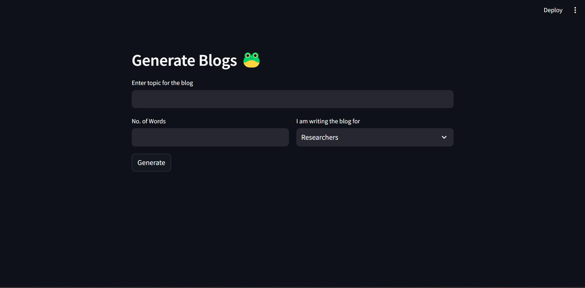
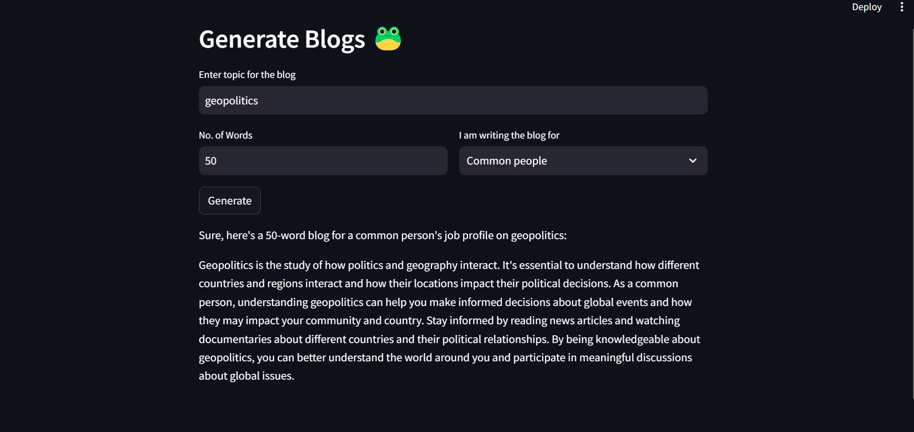

# Streamlit Application for Generating Blogs with LLama    (Using Replicate API)


This Streamlit application interacts with the Replicate API to generate blog content based on user inputs for topic, number of words, and blog style.

## Features:

- **Input Fields**: Users can enter a topic for the blog, specify the number of words, and select a job profile style (Researchers, Data Scientist, Common people).
  
- **Generate Button**: Initiates the blog generation process using the Replicate API.
  
- **Real-time Output**: Displays the generated blog content directly on the Streamlit interface.

## Getting Started:

To run this application locally, follow these steps:

### Prerequisites:

- Python 3.x installed on your system.
- Install required Python packages using pip:
  
  ```bash
  pip install streamlit replicate
### Installation

1. Clone this repository:

    ```bash
    git clone https://github.com/hahaanisha/Blog-generator.git
    cd Blog-generator
    ```

    Replace `<repository_url>` with your actual repository URL.

### Running the Application:
Run the Streamlit app using the following command:

    ```bash
    streamlit run app.py
    ```

### Usage:

- Enter a topic for the blog.
- Specify the number of words required for the blog.
- Select the appropriate job profile style (Researchers, Data Scientist, Common people).
- Click on the "Generate" button to initiate the blog generation process.
- View the generated blog content on the Streamlit interface.

### Output:



### Configuration
### (please put your own API key as the API key in code is disabled for security reasons)
Ensure you have set up your Replicate API token correctly in the `getResponse` function:

    ```python
    replicate_client = replicate.Client(api_token="your_replicate_api_token_here")
    ```

Replace `"your_replicate_api_token_here"` with your actual Replicate API token.

### Dependencies

- Streamlit: For building the web application interface.
- Replicate: For interacting with the Replicate API to generate text.

## Author
- [Anisha Shankar](https://github.com/hahaanisha)
